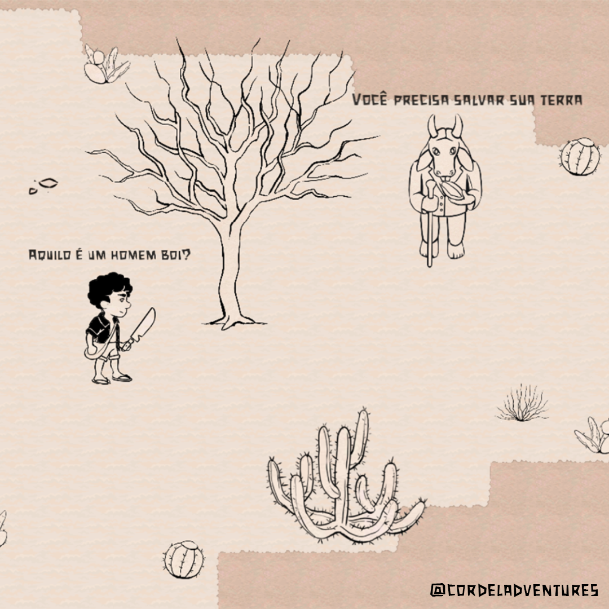
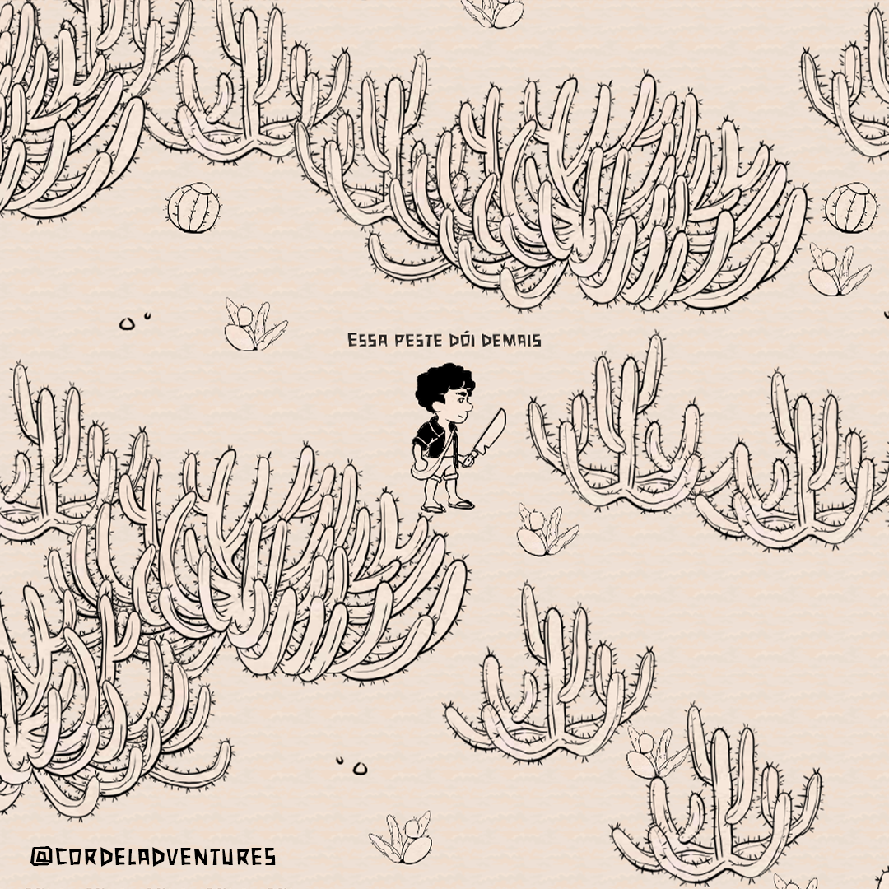

# Cordel Adventures

> Jogo de Exploração e Aventura em um mundo inspirado na cultura Nordestina.

### Ajustes e melhorias

O projeto ainda está em desenvolvimento e as próximas atualizações serão voltadas nas seguintes tarefas:

-   [x] Sistema de Movimentação;
-   [x] Sistema de Combate;
-   [x] Sistema de Diálogo;
-   [x] Demo Jogável (09/07);
-   [ ] Publicação (01/08);

### Linguagens e Tecnologias

 
