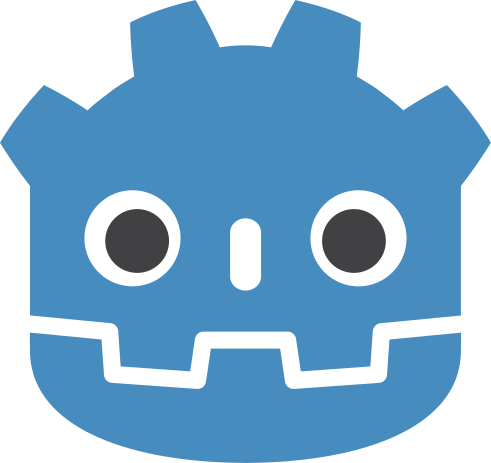

# Cordel Adventures

<!---Esses são exemplos. Veja https://shields.io para outras pessoas ou para personalizar este conjunto de escudos. Você pode querer incluir dependências, status do projeto e informações de licença aqui--->

> Jogo de Exploração e Aventura em um mundo inspirado na cultura Nordestina.

### Ajustes e melhorias

O projeto ainda está em desenvolvimento e as próximas atualizações serão voltadas nas seguintes tarefas:

-   [x] Sistema de Movimentação;
-   [x] Sistema de Combate;
-   [x] Sistema de Diálogo;
-   [ ] Demo Jogável (09/07);

### Linguagens e Tecnologias

 
